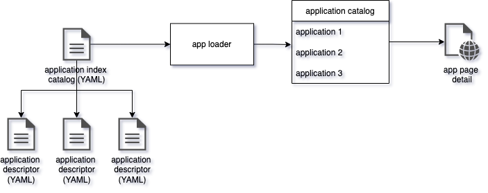

# flask-yaml-js

proof of concept, yaml data loader and web view with js components.



```shell
# install
cd flask-yaml-js
python3 -m venv venv
source venv/bin/activate
pip install -r requirements.txt

# run terminal
export FLASK_APP=hello
flask run --host=0.0.0.0
```

see [developer guide](doc/guide.md) for more details.
