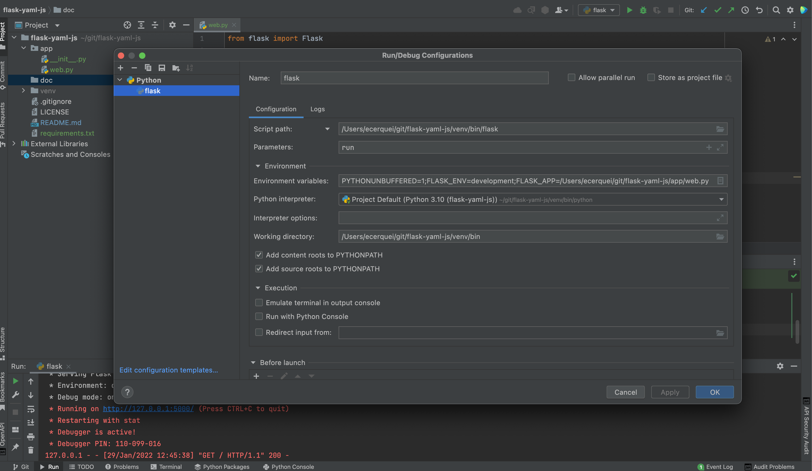

# developer guide

use official [Flask documentation](https://flask.palletsprojects.com/en/2.0.x/) for further references.

## configuring pycharm to run and debug your flask app

ensure to set the following env variables:
* FLASK_APP pointing to web.py absolut path
* FLASK_ENV for development

script path to flask app from your python venv.

